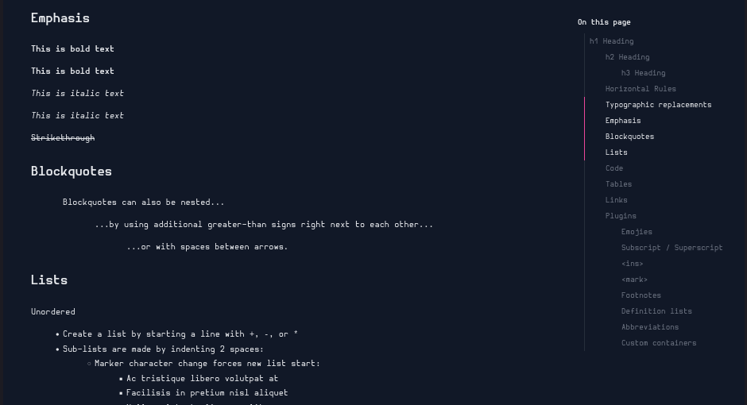

# Smoothly animated table of contents

This is a demo project of a smoothly animated table of contents. It is a simple web app rendering Markdown content with a table of contents that smoothly highlights currently active headings.

## Stack

- [Bun — A fast all-in-one JavaScript](https://bun.sh/)
- [`framer-motion`](https://www.framer.com/motion/) for animations.
- [`zustand`](https://zustand-demo.pmnd.rs/) for state management.
- [`kuma-ui`](https://www.kuma-ui.com/) for building UI components
  - [Installation | Kuma UI](https://www.kuma-ui.com/docs/install)
- `prettier` for formtting code
- [`modern-normalize`](https://github.com/sindresorhus/modern-normalize) for normalizing browsers' default style

